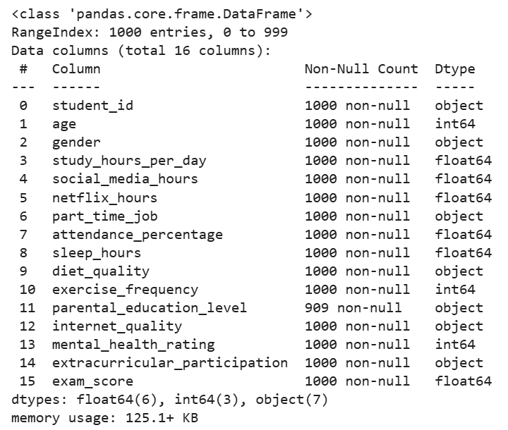
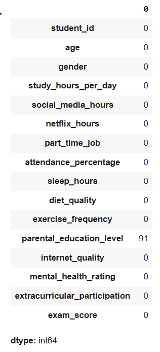
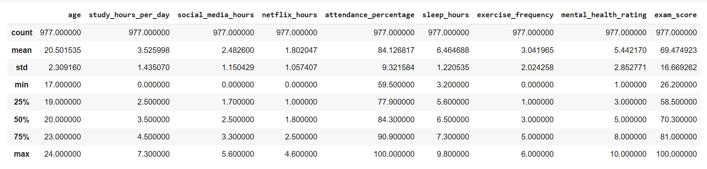
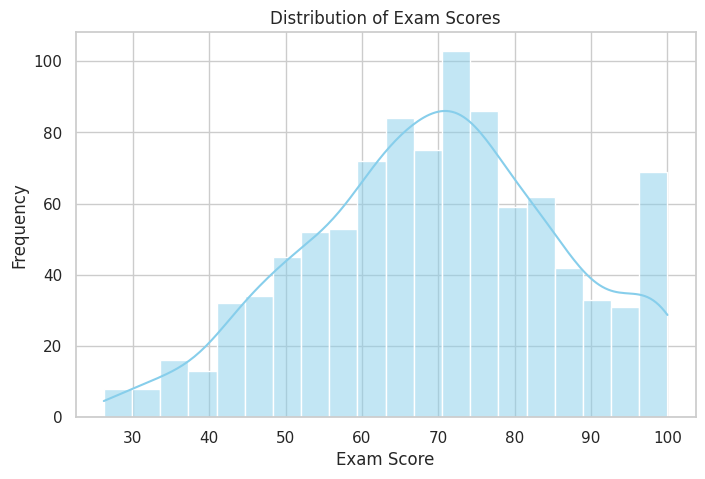
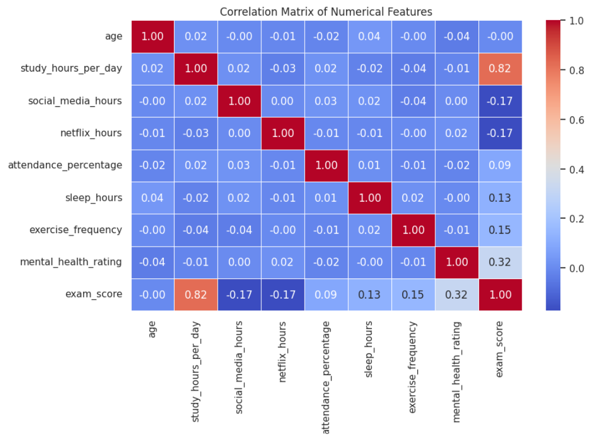
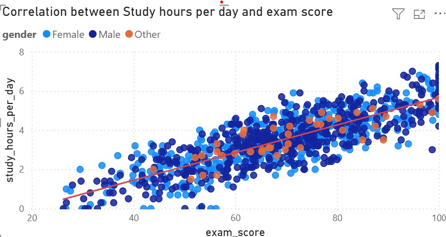
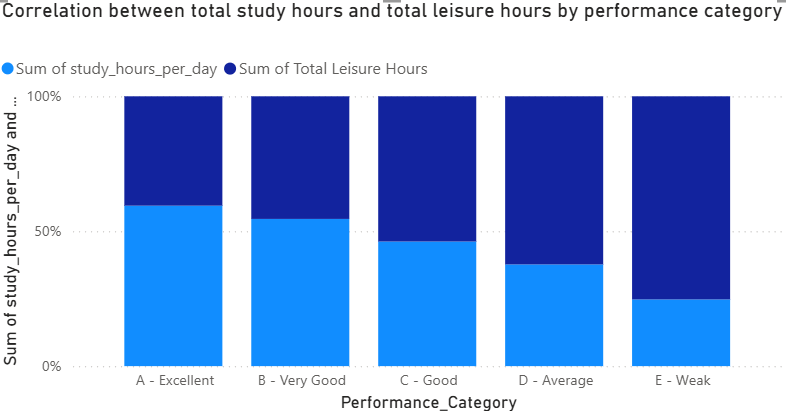
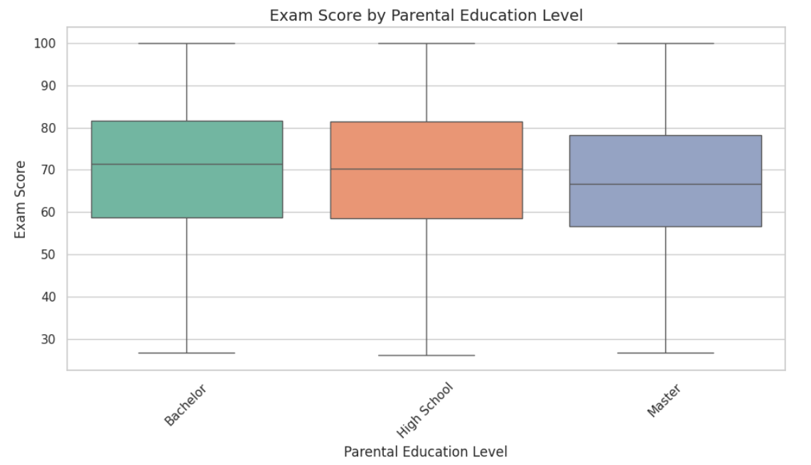
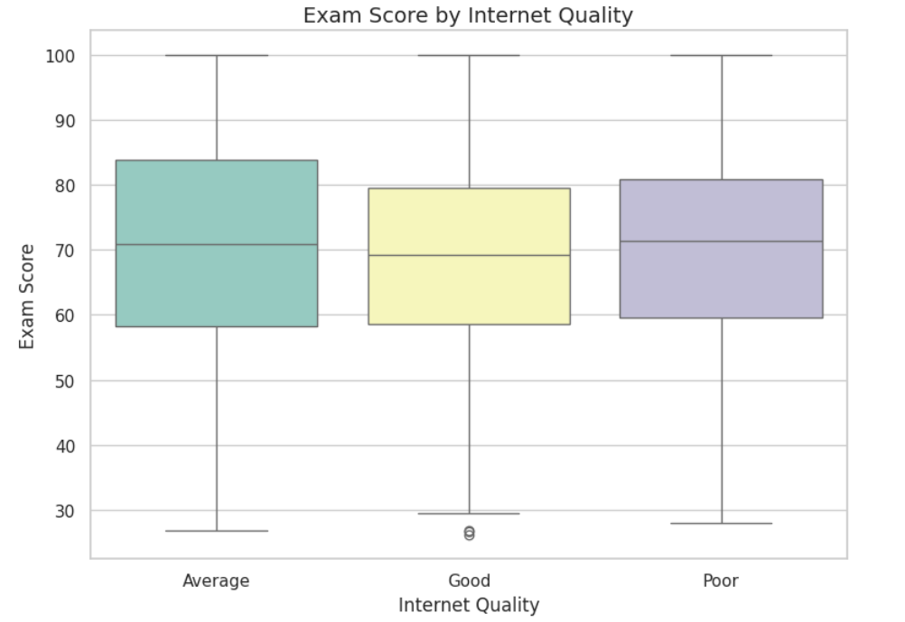

# The relationship between Student Habits and Academic Performance

## 1. Introduction:

Student performance is shaped by a combination of study habits, health habits and related environmental factors. By analysing data on these behaviours, this project seeks to explore patterns associated with exam success, identify the most influential factors and develop a predictive model to support learning improvement.

## 2. Purposes and Outcomes:

### 2.1 Purposes:
This project aims to:
- Explore how student habits affect exam score.
- identify key influencing factors
- Build a prediction model for exam scores.
- Provide actionable recommendations to help students improve their results.

### 2.2 Outcomes:

- Understanding the relationships between student habits and exam score.
- Identify the factors that have the greatest impact on the exam score.
- Prediction model for exam score based on student habits.
- Actionable recommendations for improving exam score.

## 3. Technologies and Tools:

- Python: Data processing and analysis.
- Google Colab: Code execution
- Power BI: Utilized for data visualization.
-  GitHub: Code versioning and documentation.
-  PowerPoint: Presentation of results and insights.
## 4. Data Sources:
- Source: Public dataset from Kaggle (Student Habits vs Academic Performance): https://www.kaggle.com/datasets/jayaantanaath/student-habits-vs-academic-performance/data.

- Description: This dataset explores the relationship between student habits and exam score. It contains multiple variables related to study habits, health habits, and enviromental factors.
## 5. Data overview:
|    | student_id   |   age | gender   |   study_hours_per_day |   social_media_hours |   netflix_hours | part_time_job   |   attendance_percentage |   sleep_hours | diet_quality   |   exercise_frequency | parental_education_level   | internet_quality   |   mental_health_rating | extracurricular_participation   |   exam_score |
|---:|:-------------|------:|:---------|----------------------:|---------------------:|----------------:|:----------------|------------------------:|--------------:|:---------------|---------------------:|:---------------------------|:-------------------|-----------------------:|:--------------------------------|-------------:|
|  0 | S1000        |    23 | Female   |                   0   |                  1.2 |             1.1 | No              |                    85   |           8   | Fair           |                    6 | Master                     | Average            |                      8 | Yes                             |         56.2 |
|  1 | S1001        |    20 | Female   |                   6.9 |                  2.8 |             2.3 | No              |                    97.3 |           4.6 | Good           |                    6 | High School                | Average            |                      8 | No                              |        100   |
|  2 | S1002        |    21 | Male     |                   1.4 |                  3.1 |             1.3 | No              |                    94.8 |           8   | Poor           |                    1 | High School                | Poor               |                      1 | No                              |         34.3 |
|  3 | S1003        |    23 | Female   |                   1   |                  3.9 |             1   | No              |                    71   |           9.2 | Poor           |                    4 | Master                     | Good               |                      1 | Yes                             |         26.8 |
|  4 | S1004        |    19 | Female   |                   5   |                  4.4 |             0.5 | No              |                    90.9 |           4.9 | Fair           |                    3 | Master                     | Good               |                      1 | No                              |         66.4 |


### Structure:
- exam_score: The final exam score of each student.
- student_id: A unique identifier assigned to each student
- age: The age of the student.
- gender: Indicates the student’s gender.
- study_hours_per_day: the number of hours spent studying per day.
- social_media_hours: the number of hours spent on social media daily.
- netflix_hours: the number of hours spent watching Netflix per day.
- part_time_job: Indicates whether the student has a part-time job.
- attendance_percentage: Percentage of classes attended by the student.
- sleep_hours: the number of hours of sleep per night.
- diet_quality: Quality of the student's diet.
- exercise_frequency: Number of exercise sessions per week.
- parental_education_level: Highest education level attained by parents.
- internet_quality: Describes the quality of the student's internet connection.
- mental_health_rating: A self-reported mental health score.
- extracurricular_participation: Indicates if the student is involved in extracurricular activities.
### Summary:

## 6. Data cleaning:
### 6.1 Removing duplicates
- Using python code to check duplicates. There are no duplicate rows in this dataset.
### 6.2 Handling missing values
- The number of missing values in all columns:
  

- Handling missing values in the parental_education_level cloumns by replace it with mode value.
```python
# Filling missing values in the 'parental_education_level' column with the most frequent value (mode)
df['parental_education_level'] = df['parental_education_level'].fillna(df['parental_education_level'].mode()[0])
```
### 6.3 Ensuring consistency
- Check unique values in categorical columns to ensure consistency.
### 6.4 Fixing incorrect data types
- Converting all categorical columns in the Data Frame to the 'category' data type
### 6.5 Identifying and handling outliers
- Outlier Detection & Removal using IQR:
```python
# Outlier Detection & Removal using IQR
def  remove_outliers_iqr(df, col):
Q1 = df[col].quantile(0.25)
Q3 = df[col].quantile(0.75)
IQR = Q3 - Q1
lower = Q1 - 1.5 * IQR
upper = Q3 + 1.5 * IQR
return df[(df[col] >= lower) & (df[col] <= upper)]
# Apply to selected numerical columns
numeric_cols = df.select_dtypes(include=['number']).columns.tolist()
for col in numeric_cols:
df = remove_outliers_iqr(df, col)
```
## 7. Exploratory data analysis
### 7.1  Summary Statistics
- Now, let's take a look at some descriptive information of this dataset after cleaning:
 
 **Observations**
-   Average exam score: 69.5 (range: 26.2 → 100.0)
-   Average study time: 3.53 hours/day, with some students studying 0 hours and others up to 7.3 hours
-   Average social media use: 2.5 hours/day (up to 5.6 hours)
-   Average netflix use: 1.8 hours/day (up to 4.6 hours)
-   Average attendance: 84.1% (up to 100%)
-   Average sleep: 6.5 hours (minimum 3.2h, maximum 9.8h)
-   Average exercise: 3 (range: 0 -> 6)
-   Average mental health rating: 5.4 (range: 1 -> 10)
### 7.2 Exploring the distribution of objective variable
- Using histogram to visualize the distribution of exam_scores (objective variable):


**Observation**
- The distribution is fairly normal, with a slight left skew (a slight skew toward lower scores).
- Many students have exam scores ranging from 60 to 80.
- Some students scored very low (20-30), while others achieved a perfect score of 100.
### 7.3 Correlation Analysis
- Creating a heatmap to visualize correlations:


**Key Correlations:**
-  exam_Score and study_hours_per_day: +0.82 Very strong => Studying more is closely associated with higher exam scores.
-  exam_score and mental_health_rating: +0.32 Moderate => Better mental health tends to support more effective learning.
-  exam_score and exercise_frequency: +0.15 Weak => Regular exercise has a slight positive effect.
-  exam_score and sleep_hours: +0.13 Weak => Sleep enough has a slight positive effect.
-  exam_score and social_media_hours/netflix_hours: -0.17 Weak – There is a slight negative correlation, suggesting that spending more time for social media or watching more Netflix tends to be associated with lower exam scores.
  
**Conclusion**
-  Study hours have the strongest impact on exam performance
-  Mental health is the only health-related factor with a noticeable correlation to academic success.
- Sleep and exercise play a role but are not strongly influential – further analysis is needed, especially by comparing high vs. low performers.
-  There is a weak negative correlation between entertainment time (Netflix, social media) and exam scores. This suggests that spending too much time on leisure may slightly reduce academic performance. While not a direct cause, it highlights the importance of balancing study and entertainment for better results.
### 7.4 Exploring the relationship between exam score and study habits
In the scope of this project and dataset, the factors considered as study habits include:

- study_hours_per_day
- social_media_hours
- netflix_hours
- part_time_job
- attendance_percentage
- extracurricular_participation.

**The following section presents a detailed analysis of the relationship between exam scores and key influencing factors.**

#### 7.4.1 Exam_score and study_hours_per_day



**Insight**
- There is a strong positive correlation between study hours per day and exam scores, indicating that students who dedicate more time to studying tend to achieve higher academic performance.
- This trend is consistent across all gender groups, suggesting that consistent daily study hours are a key factor in improving exam results, regardless of gender.
 
**Conclusion**
- There is a clear positive correlation between study hours per day and exam scores. Students who study more tend to achieve higher exam scores, regardless of gender.

#### 7.4.2 Exam_score with social_media_hours and netflix_hours

**The exam performance of students is categorized based on their scores using the following classification:**

| **Performance Category** | **Score Range (exam_score)** |
|--------------------------|------------------------------|
| A - Excellent            | 90 – 100                     |
| B - Very Good            | 80 – 89                      |
| C - Good                 | 65 – 79                      |
| D - Average              | 50 – 64                      |
| E - Weak                 | Below 50                     |


**Total Leisure Hours = social_media_hours + netflix_hours**




**Insight:**
- As performance category decreases from A - Excellent to E - Weak, the proportion of study hours per day decreases, while the proportion of leisure hours increases.
- Students in the "Excellent" and "Very Good" categories spend over 50% of their daily time on studying, while those in the "Weak" category spend significantly less time studying and more time on leisure.

**Conclusion**
- There is a clear inverse relationship between leisure time and academic performance. Students with higher performance tend to dedicate more time to studying and less to leisure activities, whereas lower-performing - students exhibit the opposite pattern.
- Balancing leisure and study time effectively appears crucial for better academic outcomes.

#### 7.4.3 Exam_score with attendance_percentage


### 7.5 Exploring the relationship between exam score and health habits

In the scope of this project and dataset, the factors considered as health habits include:

- exercise_frequency
- sleep_hours
- mental_health_rating
- diet_quality

**The following section presents a detailed analysis of the relationship between exam scores and key influencing factors.**

#### 7.5.1 Exploring the relationship between exam score and excersise_frequency


### 7.6 Exploring the relationship between exam score and related environmental factors
#### 7.6.1 Exam_score and parental_education_level


**Observations**

-   There are three groups: Master, High School, and Bachelor.
-   The Bachelor group has the highest median score (72), followed by High School, and lastly Master (66).
-   The score distribution of the Master group is skewed toward lower scores.
-   The Bachelor group tends to have higher scores, with more stable distribution.

**Conclusion:**

-   The group with parents holding a Bachelor's or High School education has a slightly higher median score compared to the Master's group, which is contrary to common expectations.This could be due to other factors such as expectations or pressure.

=> Parental education level does not have a linear relationship with exam results. It may have an indirect influence, but it is not a determining factor.
Observations

#### 7.6.2 Exam_score and internet_quality



**Observations**

-   All three groups (Poor, Average, Good) have similar median scores (around 70).
    
-   The Average group has the highest median, followed by Poor, and lastly Good (which is surprising, as expectations usually suggest the opposite).
  
**Conclusion:**

-   Internet quality does not have a clear or consistent impact on exam scores. Students with "Good" Internet do not necessarily achieve higher scores.
    
-   This suggests that Internet quality is not a direct determining factor in academic performance—students may use the Internet for various purposes, not just for studying.
## 8. Data modeling
## 9. Outcomes:
