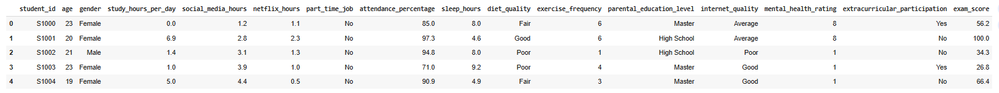

# The relationship between Student Habits and Academic Performance
## 1. Purposes and Outcomes:
### Purposes:
- 	Analyze the impact of student habits (study hour per day, social media hours, exercise frequency, …) on Academic performance (Exam score).
- 	Identify the factors that have the greatest impact on the exam score.
- 	Develop a regression model to predict exam score based on student habits.
### Outcomes:
- 	Understanding the relationships between student habits and exam score.
- 	Identify the factors that have the greatest impact on the exam score.
- 	Prediction model for exam score based on student habits.
- 	Actionable recommendations for improving exam score.
## 2. Technologies and Tools:
- 	Python: Data processing and analysis.
- 	Google Colab: Code execution and presentation.
- 	Power BI: Utilized for data visualization.
- 	GitHub: Code versioning and documentation.
- 	PowerPoint: Presentation of results and insights.

## 3. Data Sources:
- 	Source: Public dataset from Kaggle (Student Habits vs Academic Performance): https://www.kaggle.com/datasets/jayaantanaath/student-habits-vs-academic-performance/data.
- 	Description: This dataset explores the relationship between student habits and exam score. It contains multiple variables related to study habits, health habits, and enviromental factors.
## 4. Data overview:

### Structure:
- 	exam_score: The final exam score of each student.
- 	student_id
- 	age: The age of the student.
- 	gender: Indicates the student’s gender.
- 	study_hours_per_day: the number of hours spent studying per day.
- 	social_media_hours: the number of hours spent on social media daily.
- 	netflix_hours: the number of hours spent watching Netflix per day.
- 	part_time_job: Indicates whether the student has a part-time job.
- 	attendance_percentage: Percentage of classes attended by the student.
- 	sleep_hours: the number of hours of sleep per night.
- 	diet_quality: Quality of the student's diet.
- 	exercise_frequency: Number of exercise sessions per week.
- 	parental_education_level: Highest education level attained by parents.
- 	internet_quality: Describes the quality of the student's internet connection.
- 	mental_health_rating: A self-reported mental health score.
- 	extracurricular_participation: Indicates if the student is involved in extracurricular activities.
